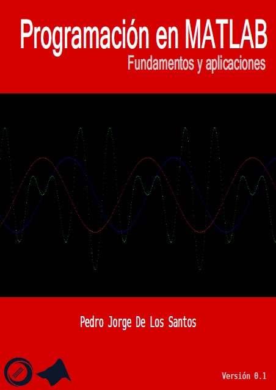

## Programación en MATLAB, fundamentos y aplicaciones



### Contenido

* Capítulo 1. Fundamentos del lenguaje
* Capítulo 2. Vectores y matrices
* Capítulo 3. Arreglos de celdas, estructuras y cadenas de caracteres.
* Capítulo 4. Gráficas
* Capítulo 5. Exportar e importar datos
* Capítulo 6. Matemáticas con MATLAB
* Capítulo 7. Procesamiento de imágenes
* Capítulo 8. Introducción a las GUIs
* Capítulo 9. Programación orientada a objetos
* Capítulo 10. Recomendaciones generales

### Descargar PDF

[Versión actual (0.1) (En desarrollo)](https://goo.gl/st1S0x)


### Contribuciones / Más información

Cualquier comentario, sugerencia o corrección respecto al contenido puede informar a través de las *issues* 
o bien en cuaquiera de las siguientes medios.

```
E-mail  : delossantosmfq@gmail.com
Twitter : @pjdlsl
```


### Licencia

<a href="http://creativecommons.org/licenses/by-nc-sa/4.0/">
</a>
<br /><font size="2"> <b>Programación en MATLAB, fundamentos y aplicaciones</b> está liberado bajo una licencia <a rel="license" href="http://creativecommons.org/licenses/by-nc-sa/4.0/"> (CC BY-NC-SA 4.0)</a></font>
