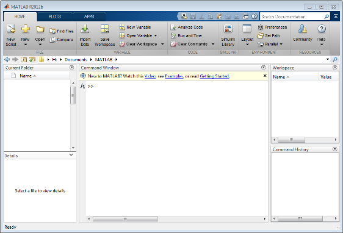

# Fundamentos del lenguaje

## ¿Qué es MATLAB?

MATLAB es un lenguaje de programación de alto nivel y entorno de
desarrollo interactivo, utilizado para numerosas aplicaciones de
carácter técnico y científicas. MATLAB permite realizar adquisición y
análisis de datos, desarrollo de algoritmos computacionales, creación y
simulación de modelos físicos y la visualización gráfica de procesos
determinados. Entre los campos de uso de MATLAB se incluyen el
procesamiento digital de señales, audio, imágenes y vídeo, sistemas de
control, finanzas computacionales, biología computacional, redes
neuronales, etc.

*Características del lenguaje:*

* Interpretado: Esta característica le convierte en un lenguaje no muy
apto para aplicaciones donde la rapidez de ejecución sea crítica,
pero esto mismo facilita la depuración de errores y permite un
tiempo de desarrollo reducido en comparación a los lenguajes
compilados tradicionales como C/C++.

* Tipado dinámico: No es necesario declarar el tipo de variable a
utilizar, MATLAB reconoce de forma automática el tipo de dato con el
que trabajará, aunque claro que es posible declarar un tipo de dato
de forma explícita utilizando las funciones de conversión adecuadas.

* Multiplataforma: MATLAB está disponible para las plataformas más
comunes: Unix, Windows, GNU/Linux y Mac OS.

* Multiparadigma: Soporta programación imperativa, funcional y
orientada a objetos.

## Descripción del entorno de desarrollo

El entorno de MATLAB mostrado en la figura [1](#f1) pertenece a la versión
2012b, si dispone de otra versión quizá encontrará cambios
significativos en la interfaz, pero los componentes más importantes
permanecen invariables.

Como puede observarse en la figura [1](#f1), se distinguen cuatro
componentes en el escritorio del entorno MATLAB, los cuáles son:

**Command Window**

Ventana de comandos interactiva en la cual deberán introducirse las
instrucciones de MATLAB, el prompt `>>` le indica que está listo para
recibir instrucciones.

I> ### ¿Qué es el prompt?
I> 
I> En la jerga informática, se denomina prompt al símbolo o caracter que
I> aparece en una terminal o consola, cuando esta se encuentra en
I> disposición de aceptar un comando de entrada.

**Current Folder**

Carpeta en la que se está situado, y en la que MATLAB buscará y guardará
(por defecto) los archivos generados durante la sesión.

**Workspace**

Ventana que muestra las variables creadas por el usuario durante la
sesión, indicando el nombre, valor y tipo de la misma.

**Command History**

Permite buscar comandos introducidos con anterioridad en la ventana de
comandos y ejecutarlos nuevamente o copiarlos.

{#f1}

## Comandos básicos y generalidades

### Consultar ayuda de MATLAB

Uno de los puntos fuertes de MATLAB es la extensa documentación que
viene adjunta al software, la cual contiene múltiples ejemplos y
recomendaciones para la mayoría de las funciones. Puede acceder a la
ayuda ubicando el ícono característico de ayuda, o bien tecleando la
instrucción doc en la línea de comandos.

Si requiere una referencia rápida acerca de un comando o función puede
utilizar el comando `help` seguido por el nombre la función a consultar,
lo anterior le mostrará en la ventana de comandos una descripción breve
referente a la función consultada, por ejemplo la siguiente línea le
permite consultar ayuda rápida acerca del comando `clc`:

    >> help clc
        clc    Clear command window.
        clc clears the command window and homes the cursor.
        See also home.
        Reference page in Help browser
        doc clc

### Limpiar ventana de comandos y variables del workspace

Generalmente se considera una buena práctica de programación en MATLAB
iniciar los programas con instrucciones de limpiar la consola (Command
Window) y borrar las variables de la memoria. Lo anterior se logra
utilizando las instrucciones `clc` para limpiar la ventana de comandos y
`clear` para borrar las variables del workspace. Suele acompañarse a la
instrucción `clear` con el argumento adicional `all`, que permite borrar
incluso variables globales, es decir conjuntamente: `clear all.`

### Líneas de comentarios

Los comentarios de una sola línea en MATLAB deben comenzar con el
símbolo de porcentaje %, todo aquello escrito después de este símbolo
será ignorado por el intérprete y reconocido como comentario,
asignándosele un color verde característico de forma automática.

    % Esto es un comentario en MATLAB

Para hacer bloques de comentarios MATLAB dispone de una sintaxis
específica que se muestra enseguida:

    %{
    Esto es un comentario de múltiples
    líneas en MATLAB, delimitado por 
    llaves conjuntas con el signo % 
    %}

### Valores especiales

En la siguiente tabla se resumen algunos valores especiales devueltos
por funciones predefinidas en MATLAB:

|**Función** | **Descripción**|
|`ans`| Guarda el ultimo valor no asignado a una variable|
|`eps`| Tolerancia que MATLAB soporta en los cálculos|
|`intmax`| Máximo valor entero que puede utilizarse|
|`intmin`| Mínimo valor entero que puede utilizarse|
|`realmax`| Valor de coma flotante máximo que puede representarse|
|`realmin`| Valor de coma flotante mínimo que puede representarse|
|`pi`| Constante matemática (3.14159265…)|
|`inf`| Valor asignado a un número demasiado grande respecto a la capacidad de cálculo del software.|
|`NaN`| Iniciales de “Not a Number”, tal cual traducción literal hace referencia a un valor numérico inválido.|
|`computer`| Devuelve el tipo de computadora que se está utilizando|
|`version`| Devuelve la versión de MATLAB|

## Tipos de datos y operadores

Los tipos de datos más comunes en MATLAB son los siguientes:

* logical (tipo booleano o lógico)
* char (cadenas de caracteres)
* numeric (datos tipo numérico)
    * int8, int16, int32, int64 (tipos entero)
    * uint8, uint16, uint32, uint64 (enteros sin signo)
    * single (flotantes de precisión simple)
    * double (flotantes de precisión doble)
* cell (arreglos de celdas)
* struct (estructuras)

### Tipo logical

Las variables de tipo lógico permiten, evidentemente, dos valores, que
pueden ser true o false (1 y 0 lógicos). Una forma de declarar una
variable de tipo lógico sería:

    >> a = true
    a =
         1

Otra manera que resulta en lo mismo es la siguiente:

    >> a=logical(1)
    a =
         1

Las líneas anteriores crean una variable `a` de tipo lógico con un valor
true (1 lógico).

### Tipo char

Son cadenas de caracteres, que pueden contener valores alfanuméricos e
incluso símbolos especiales. Para declararlas no hace falta especificar
que son variables tipo char, dado que MATLAB es de tipado dinámico y
reconoce como tal aquellas cuyo valor asignado se encuentre delimitado
por comillas simples, un ejemplo muy clásico es el siguiente:

    >> txt = 'Hola Mundo'
    txt =
    Hola Mundo

### Tipo numeric

Normalmente cuando en MATLAB tecleamos un valor numérico o bien lo
asignamos a una determinada variable, esta será de tipo double, a menos
que se haga una conversión explicita a otro tipo de dato. Por ejemplo,
si insertamos en MATLAB lo siguiente:

    >> num = 10
    num =
        10

Y posteriormente tecleamos la instrucción `whos` para verificar el tipo
o clase de dicha variable:

    >> whos
      Name      Size            Bytes  Class     Attributes
      num       1x1                 8  double   

Si se requiere utilizar un dato de tipo entero habrá de realizarse la
conversión como sigue:

    >> numInt = int8(23)
    numInt =
       23
    >> whos
      Name        Size            Bytes  Class    Attributes
      numInt      1x1                 1  int8               

### Tipo cell

Un cell array es un tipo de dato característico del lenguaje MATLAB que
consiste en un arreglo multidimensional de celdas que pueden contener
cualquier tipo de dato, inclusive otro cell array. Un ejemplo muy
sencillo de cell array se muestra enseguida:

    >> C={10,'MATLAB','5',[1 1]}
    C = 
        [10]    'MATLAB'    '5'    [1x2 double]

### Tipo struct

Las estructuras son arreglos de datos que, de forma similar a los cell
arrays, pueden almacenar variables de diversos tipos. Para la
organización de los datos se utilizan campos que pueden contener sólo un
tipo de dato. A continuación se muestra un ejemplo de cómo crear una
estructura:

    >> Alumno.Nombre='Jorge';
    >> Alumno.Apellido='De Los Santos';
    >> Alumno.Cursos={'Programación','Cálculo','Métodos Numéricos'};
    >> Alumno.Notas=[10 9 10];
    >> Alumno
    Alumno = 
          Nombre: 'Jorge'
        Apellido: 'De Los Santos'
          Cursos: {'Programación'  'Cálculo'  'Métodos Numéricos'}
           Notas: [10 9 10]

En el capítulo 3 se tratan con más detenimiento las estructuras y su
utilidad en la programación en MATLAB.

### Referencias de función (function handle)

Las function handle son referencias asociadas a una función nativa de
MATLAB o bien a una función anónima creada por el usuario.

El siguiente ejemplo muestra la creación de una función anónima y su
posterior uso mediante su referencia:

    >> f=@(x) x+cos(x)
    f = 
        @(x)x+cos(x)
    >> whos
      Name      Size            Bytes  Class              Attributes
      f         1x1                32  function_handle              
    >> fzero(f,0) % Raíz de la función 
    ans =
       -0.7391
    >> f(pi/2) % Evaluando función en un punto
    ans =
        1.5708

### Identificar tipos de datos

Para identificar tipos de datos en MATLAB se cuentan con diversos
comandos que nos facilitan esta tarea. El comando whos nos proporciona
información acerca de las variables existentes en el workspace, tales
como el nombre, tamaño y tipo. A manera de ejemplo crearemos las
siguientes variables e introducimos la instrucción whos para verificar
el tipo de información que nos imprime en la consola:

    >> n=10;
    >> val=false;
    >> s='MATLAB';
    >> C={1,2,3};
    >> ST.Nombre='Anna';
    >> whos
      Name      Size            Bytes  Class      Attributes
      C         1x3               360  cell                 
      ST        1x1               184  struct               
      n         1x1                 8  double               
      s         1x6                12  char                 
      val       1x1                 1  logical      
     

Además del comando `whos`, puede utilizarse la función `class` para
determinar el tipo de dato de una variable pasada como argumento, por
ejemplo:

    >> a=3;
    >> class(a)
    ans =
    double

### Conversiones entre tipos de datos

Las conversiones entre tipos de datos son muy utilizadas en la
programación en cualquier lenguaje, puesto que permiten controlar la
precisión de los cálculos, mejorar la presentación de los datos o bien
evitar errores en la ejecución.

#### Entre tipos numéricos

Cuando se crea una variable de tipo numérico en MATLAB por defecto será
de tipo double, por ejemplo, creamos una variable llamada num:

    >> num=2;
    >> class(num)
    ans =
    double

Las conversiones entre tipos numéricos son de sintaxis muy sencilla,
solo habrá que especificar el tipo de dato al cual se convertirá, siendo
permitidos los especificados en la tabla siguiente:

|**Tipo de dato** | **Sintaxis de conversión** | **Rango**|
|Precisión doble | double(num) | 2.2251e-308 a 1.7977e+308|
|Precisión simple | single(num) | 1.1755e-38 a 3.4028e+38|
|Entero de 8 bits | int8(num) | -128 a 127|
|Entero de 16 bits | int16(num) | -32768 a 32767|
|Entero de 32 bits | int32(num) | -231 a 231-1|
|Entero de 64 bits | int64(num) | -263 a 263-1|
|Entero sin signo de 8 bits | uint8(num) | 0 a 255|
|Entero sin signo de 16 bits | uint16(num) | 0 a 65535|
|Entero sin signo de 32 bits | uint32(num) | 0 a 4294967295|
|Entero sin signo de 64 bits | uint64(num) | 0 a 18446744073709551615|

Así, podemos convertir la variable num, creada con anterioridad, a otro
tipo de dato numérico, por ejemplo a un entero de 8 bits:

    >> num=int8(num);
    >> class(num)
    ans =
    int8

Es necesario poner especial atención en los rangos que pueden
manipularse con cada tipo numérico, debido a que por ejemplo si se
realiza la siguiente conversión:

    >> num=int8(653)
    num =
      127

El valor que ha sido pasado como argumento de conversión excede el rango
para un entero de 8 bits, por lo cual simplemente se le asigna el máximo
valor permitido para una variable de este tipo.

Si requiere verificar por usted mismo los valores máximos y mínimos
permitidos para cada tipo de dato, puede usar las funciones `realmin` y
`realmax` para los tipos de coma flotante, y las correspondientes
`intmin` e `intmax` para tipos enteros.

#### De string a tipo numérico

Para este tipo de conversiones MATLAB dispone de la funciones
`str2double` y `str2num`, en algunos casos no notará la diferencia en
los resultados, salvo en la rapidez de ejecución. Pese a lo anterior, es
necesario tomar en cuenta cómo trabaja cada función y cual le resulta de
utilidad; con `str2double` se convierte una variable tipo string en un
valor de tipo double, la función `str2num` también realiza conversión a
tipo double pero además realiza conversiones a otros tipos de datos
numéricos si se especifica de manera explícita, de hecho esta tiene una
funcionalidad muy similar a la de la función `eval`. Los siguientes
ejemplos muestran las diferencias y utilidades de las funciones
descritas.

    >> a=str2double('1237')
    a =
            1237
    >> b=str2num('1237')
    b =
            1237
    >> whos
      Name      Size            Bytes  Class     Attributes
      a         1x1                 8  double              
      b         1x1                 8  double     

