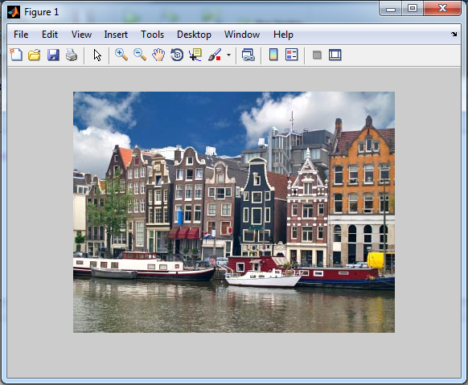

# Procesamiento de imágenes

El procesamiento digital de imágenes (PDI o DIP por sus siglas en
inglés) es un campo de investigación científica muy interesante y cuyas
aplicaciones son tan diversas, tales como la medicina, el control de
calidad en la industria, astronomía, visión artificial, etc. Lo anterior
nos hace deducir que para abarcar “decentemente” la mayoría de los
tópicos comunes del PDI se necesitaría más de un libro completo, por lo
cual se pretende aclarar que en este capítulo se tratarán solamente
algunos temas con un nivel de detalle elemental, con la esperanza de que
sirva al amable lector como una breve introducción y sobre todo, en
medida de lo posible, motivarle para adentrarse en tan maravilloso
mundo.

# Conceptos iniciales del procesamiento de imágenes

### ¿Qué es el procesamiento de imágenes?

El procesamiento digital de imágenes es el conjunto de técnicas
aplicadas a imágenes digitales con un cierto objetivo, los cuales pueden
ser: mejorar la calidad de la imagen, detección/reconocimiento de formas
o colores, realce de ciertas regiones de la imagen, etc.

### Aplicaciones del procesamiento de imágenes

## Importar y mostrar imágenes

En MATLAB, como en cualquier otro software de procesamiento, las
imágenes son tratadas como matrices, cuyos elementos corresponden a un
valor especifico de cada píxel que la compone. La función `imread`
permite leer/importar imágenes en casi cualquier formato conocido
(*.bmp, *.png, *.tiff, *.jpg, etc). La sintaxis de `imread` es muy
simple, basta con pasar como argumento la dirección absoluta o relativa
del archivo correspondiente a la imagen de interés, por ejemplo la
siguiente instrucción lee la imagen “img.jpg” ubicada en la carpeta de
trabajo (Current Folder).

    >> A=imread('img.png');

Con el comando `whos` podemos verificar el tipo de dato con el cual
MATLAB guarda la imagen importada:

    >> whos
      Name        Size                Bytes  Class    Attributes
      A         300x400x3            360000  uint8    

MATLAB guarda la información del color de cada píxel que compone la
imagen utilizando una matriz de tres dimensiones; las dos primeras
determinan el tamaño de la imagen y la tercera corresponde a cada una de
las capas RGB, es decir, en una matriz de mxn elementos se guarda la
información correspondiente al color rojo, en otras similares las de
color verde y azul. Por defecto el tipo de dato utilizado para la
manipulación de imágenes es el uint8 (sin signo de 8 bits).

Para mostrar una imagen que ha sido previamente leída con imread se
puede utilizar la función `imshow`. Véase el siguiente ejemplo:

    >> A=imread('imag.jpg');
    >> imshow(A);

{#f7.1}

La función `imshow` abre una nueva ventana (figure) y muestra la imagen
que ha sido guardada con anterioridad (ver figura [7.1](#f7.1)). MATLAB dispone
de otras funciones como `image` e `imagesc` que también muestran en
pantalla las imágenes, pero que suelen utilizarse más para la
visualización en análisis de datos.

## Operaciones básicas con imágenes

### Operaciones aritméticas

Recuerde que una imagen en MATLAB se almacena como una matriz de mxnxp
dimensiones, luego, es posible realizar operaciones aritméticas de suma,
resta y multiplicación sobre ella como una matriz común, tal como se ha
visto en Capítulo 2.

#### Suma de un escalar

Si sumamos una constante k a una matriz **A**, entonces cada elemento de
**A** se incrementa en k unidades, lo cual se traduciría en un aumento
del brillo en la imagen. Véase el ejemplo siguiente:

    A=imread('imag.jpg');
    k=50;
    A=A+k;
    imshow(A);

{#f7.2}

{#f7.3}

La imagen [7.2](#f7.2) corresponde a la original y en la [7.3](#f7.3) se muestra lo que
resulta de aumentar en 50 unidades cada uno de los pixeles que componen
la imagen.

#### Resta de un escalar

Es evidente que la resta de un escalar es muy similar en interpretación
a la suma vista anteriormente, solo que en este caso cada elemento de la
matriz disminuye en un valor constante. Véase el ejemplo:

    A=imread('img.jpg');
    k=80;
    A=A-k;
    imshow(A);

### Conversión a escala de grises

La escala de grises es una forma de representar imágenes digitales
utilizando solamente variaciones de grises, desde negro a blanco.

En MATLAB se dispone de la función `rgb2gray` para convertir una imagen
dada en el modelo de color RGB a una imagen en escala de grises.

    X=imread('img.png');
    XG=rgb2gray(X);
    imshow(XG);

### Binarización de una imagen

## Segmentación de imágenes

### Umbralización

### Detección de bordes

## Restauración y mejoramiento de imágenes

### Removiendo ruido
